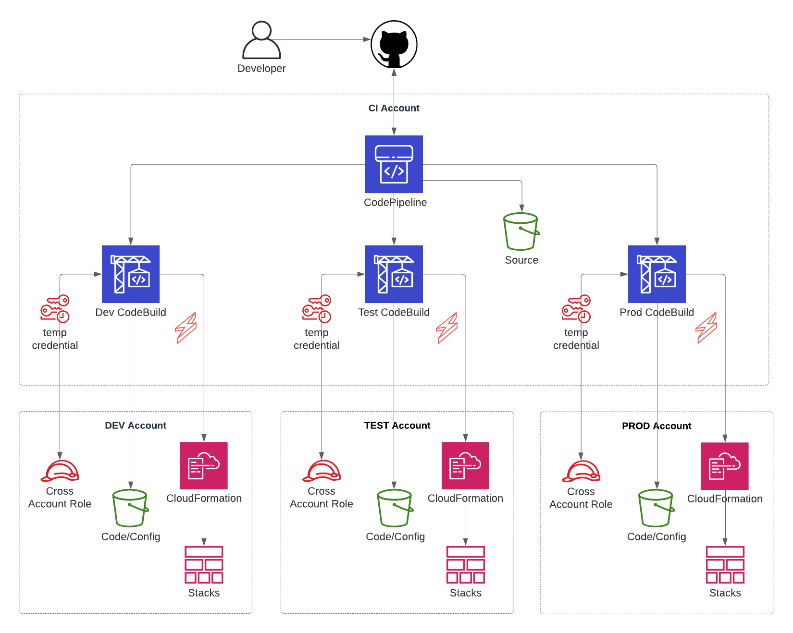

# serverless-multi-account-deploy

[Serverless multi-account deployments with CodePipeline & CodeBuild](https://unbounded.io/serverless-multi-account-deployments-with-codepipeline-codebuild-c41ce08e0ae5)



## Running the demo

### Step 1

Clone/fork repo

Create a [Slack webhook](https://api.slack.com/messaging/webhooks) (only required for the [monitor-service](pipeline/monitor-service))

Use the [ssm.sh](pipeline/ssm/ssm.sh) template to create the two required ssm params.

_Note: the demo code uses `String` type params, in production code you may want to use `SecuredString`_

### Step 2 - Create pipeline stack

Create a new stack in CloudFormation using [pipeline.yml](pipeline/pipeline.yml)

### Step 3 - Create deployer role stack

Create a new stack in CloudFormation using [deployer-role.yml](pipeline/cross-account-role/deployer-role.yml)

### Step 4 - Deploy pipeline monitor-service (optional)


From the [monitor-service](pipeline/monitor-service) directory:

**Install node dependencies:**

```bash
npm i
```

**Using the Serverless Framework deploy the monitor-service**

```bash
$(npm bin)/sls deploy
```

## Deploy demo app with pipeline

Push new commit or force a release in the CodePipeline console.

If all is successful there will be two Slack message sent to the channel:
One from CodeBuild (success status) and one from CodePipeline (approval stage notification).

**Note: For ease of demo code, most IAM policies are _not_ least privilege.**
